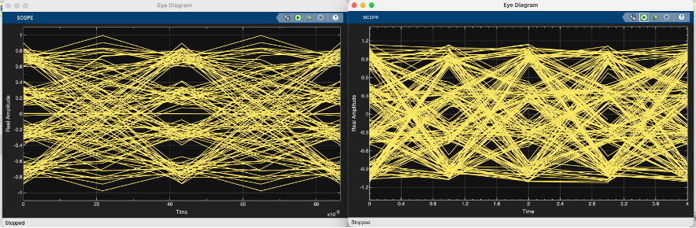

# Análisis de Diagramas de Ojo en Modulación 16-QAM

## 1. Diagrama de ojo después del modulador (Izquierda)
*Este corresponde a la señal transmitida antes de pasar por el canal.*

* **Estructura ordenada:** Los trazos presentan una trayectoria relativamente limpia y predecible.
* **Niveles definidos:** Los niveles de amplitud están claramente diferenciados.
* **Apertura del ojo:** Los ojos permanecen parcialmente abiertos.
* **Baja dispersión:** Existe poca variabilidad entre las trayectorias de los símbolos.

El estado de esta señal indica que:
1.  La señal modulada se encuentra correctamente conformada por el **filtro RRC** (Root-Raised Cosine).
2.  Existe una **sincronización adecuada** en la etapa de transmisión.
3.  La **Interferencia Intersímbolo (ISI)** es baja antes de la degradación del canal.

> [!NOTE]
> En **16-QAM** es normal que el ojo no sea totalmente "limpio" (como en BPSK) debido a los múltiples niveles de amplitud que componen la constelación.

También se destaca que los **cruces centrales** son definidos, lo que se traduce en una buena separación temporal entre los símbolos.

---

## 2. Diagrama de ojo después del receptor (Derecha)
*Este corresponde a la señal tras haber atravesado el canal y los procesos de demodulación.*

* **Mayor dispersión:** Las trayectorias de los símbolos son erráticas.
* **Ojo cerrado:** El área de decisión (ojo) se encuentra significativamente más reducida.
* **Cruce de símbolos:** Hay una mayor superposición entre las trayectorias.
* **Distorsión temporal:** Se observa una degradación en la uniformidad de las señales.

Esta degradación es consecuencia directa de factores externos e internos del sistema:
* **Ruido AWGN:** Ruido blanco gaussiano aditivo.
* **Multitrayecto:** Desfases causados por diferentes caminos de la señal.
* **ISI:** Interferencia intersímbolo incrementada por el canal.
* **Retardos:** Latencias introducidas durante la propagación.

El cierre parcial del ojo es el indicador visual de la **degradación de la señal** durante la transmisión.

A pesar de la degradación observada:
* Todavía existen **regiones abiertas** lo suficientemente amplias para la toma de decisiones.
* Los niveles siguen siendo **distinguibles** para el detector.

Esto explica por qué la información (o la imagen) aún puede reconstruirse correctamente, incluso cuando el diagrama de ojo muestra una calidad visual inferior.

  

