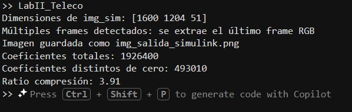

# Implementación de la compresión de la imagen

Una vez que la imagen ha sido cargada en el sistema y convertida a **escala de grises**, se procede a implementar un proceso de compresión basado en la **Transformada Wavelet de Haar**. Esta técnica pertenece a las denominadas técnicas de compresión con pérdidas y permite reducir la cantidad de información necesaria para representar una imagen, manteniendo al mismo tiempo una calidad visual aceptable.

El método se basa en descomponer la imagen en diferentes componentes que representan distintos niveles de detalle. Para aplicar correctamente la transformada de Haar es necesario que las dimensiones de la imagen permitan agrupar los píxeles en pares. Por esta razón, antes de realizar el procesamiento se ajustan las dimensiones de la imagen para garantizar que el número de filas y columnas sea par.

Posteriormente se aplica la transformada de Haar sobre la imagen. Este procedimiento consiste en calcular **promedios y diferencias entre píxeles vecinos**, lo cual permite separar la información de la imagen en componentes de baja frecuencia y alta frecuencia. Las componentes de baja frecuencia representan la estructura general de la imagen, mientras que las componentes de alta frecuencia contienen información relacionada con bordes y detalles finos.

El resultado de esta operación es una descomposición de la imagen en cuatro subbandas principales. La primera subbanda contiene la aproximación de la imagen, mientras que las otras tres subbandas contienen los detalles horizontales, verticales y diagonales. En la mayoría de las imágenes, la mayor parte de la información relevante se concentra en la subbanda de aproximación, mientras que las subbandas de detalle suelen contener valores de menor magnitud.

Para lograr la compresión se aplica un proceso de **umbralización** sobre las subbandas de detalle. Este proceso consiste en eliminar los coeficientes cuyo valor absoluto se encuentra por debajo de un determinado umbral. Estos coeficientes suelen representar variaciones pequeñas de intensidad que tienen un impacto limitado en la percepción visual de la imagen. Al establecer estos valores como cero se reduce la cantidad de información que debe almacenarse o transmitirse.

Finalmente, los coeficientes obtenidos se reorganizan formando una matriz que representa la imagen comprimida en el dominio wavelet. Esta representación mantiene la información más importante de la imagen mientras reduce la cantidad total de datos necesarios para describirla.

---

# Integración de la compresión en el sistema

El proceso de compresión se integra dentro del flujo general del sistema de procesamiento de imágenes implementado en MATLAB y Simulink. Inicialmente, el sistema carga una imagen desde un archivo en formato digital y la envía al entorno de simulación mediante el bloque **From Workspace**. Dentro del modelo de Simulink se realiza el procesamiento inicial de la imagen, incluyendo su conversión a escala de grises.

Una vez obtenida la imagen en escala de grises, esta se utiliza como entrada para el módulo de compresión basado en la transformada wavelet de Haar. El resultado del proceso de compresión es una representación transformada de la imagen en la cual muchos coeficientes han sido eliminados o reducidos, disminuyendo así la cantidad total de información.

Después de completar el procesamiento dentro de Simulink, el sistema recupera la imagen resultante en MATLAB. Debido a la forma en que Simulink maneja las señales durante la simulación, es posible que la salida contenga múltiples instantes de tiempo o frames. Por esta razón se realiza un proceso de selección que permite extraer la última imagen generada por el sistema.

Posteriormente la imagen resultante se normaliza para garantizar que sus valores de intensidad se encuentren dentro del rango adecuado para su visualización. Finalmente, la imagen reconstruida se muestra en pantalla y se guarda como un archivo de imagen, permitiendo observar el resultado del proceso de compresión aplicado.

---

# Pruebas de reducción de tamaño

Para evaluar el desempeño del algoritmo de compresión se realizan pruebas orientadas a medir la reducción efectiva de datos obtenida mediante la transformada wavelet de Haar. En estas pruebas se analiza la cantidad total de coeficientes que conforman la representación de la imagen y se compara con el número de coeficientes que permanecen diferentes de cero después del proceso de umbralización.

Los coeficientes que se convierten en cero representan información que ha sido eliminada durante el proceso de compresión. Al reducir el número de coeficientes significativos, disminuye la cantidad de datos que deben ser transmitidos o almacenados, lo cual constituye el objetivo principal del método de compresión.

A partir de estos valores se calcula una **relación de compresión**, que indica cuántos datos originales pueden representarse utilizando un número menor de coeficientes significativos. Este indicador permite evaluar cuantitativamente la eficiencia del algoritmo.

Los resultados obtenidos muestran que la transformada wavelet de Haar permite reducir de manera considerable el número de coeficientes necesarios para representar la imagen, manteniendo al mismo tiempo una representación visual reconocible. Esto confirma que el método resulta adecuado para aplicaciones de transmisión digital de imágenes, donde es importante reducir el volumen de datos sin comprometer la interpretabilidad de la información transmitida.

## Análisis del ratio de compresión obtenido

### 1. Significado del ratio de compresión (3.91)

La relación de compresión se calcula como:

CR = coeficientes totales / coeficientes no cero

Para este caso:

CR = 1,926,400 / 493,010 ≈ 3.91

Esto significa que la imagen original contiene **1,926,400 coeficientes**, mientras que después del proceso de compresión únicamente **493,010 coeficientes permanecen diferentes de cero**.

Otra forma de interpretarlo es mediante la cantidad de información eliminada durante la compresión:

| Tipo | Cantidad |
|-----|-----|
| Coeficientes totales | 1,926,400 |
| Coeficientes eliminados | 1,433,390 |
| Coeficientes conservados | 493,010 |

El porcentaje de coeficientes eliminados es aproximadamente:

\[
\frac{1,433,390}{1,926,400} \times 100 \approx 74.3\%
\]

Por lo tanto, **aproximadamente el 74 % de los coeficientes fueron eliminados**, lo cual indica una reducción significativa de datos mientras se conserva la información principal de la imagen.

---

## Interpretación visual de la compresión

En la Transformada Wavelet de Haar, la imagen se descompone en cuatro subbandas principales:

- **LL**: contiene la mayor parte de la información de la imagen.
- **LH**: representa los bordes horizontales.
- **HL**: representa los bordes verticales.
- **HH**: contiene detalles finos y ruido de alta frecuencia.

Durante el proceso de compresión se aplica un **umbral (threshold)** sobre los coeficientes de las subbandas de detalle. Cuando se aplica este umbral:

- muchos coeficientes en **LH, HL y HH** se vuelven cero
- solo se mantienen los coeficientes más significativos

Esto reduce la cantidad de información necesaria para representar la imagen sin afectar de manera significativa su apariencia visual.

---

## Ajuste del nivel de compresión

El nivel de compresión depende del **valor del umbral utilizado en el proceso de eliminación de coeficientes**.

Un umbral mayor produce una mayor compresión, aunque también puede generar mayor pérdida de calidad visual.

Ejemplo de valores típicos:

| Umbral | Compresión | Calidad |
|------|------|------|
| 15 | 3.9 : 1 | casi sin pérdida |
| 25 | 6 : 1 | leve pérdida |
| 40 | 10 : 1 | pérdida visible |
| 60 | 15 : 1 | fuerte pérdida |

Esto permite ajustar el sistema dependiendo del equilibrio deseado entre **calidad de imagen y reducción de tamaño de datos**.

---

## Interpretación del resultado para el laboratorio

En este proyecto se aplicó la **Transformada Wavelet Haar** a la imagen procesada. Posteriormente se aplicó un umbral sobre los coeficientes de detalle (LH, HL y HH), eliminando aquellos de magnitud pequeña.

El sistema obtuvo un **ratio de compresión de 3.91:1**, eliminando aproximadamente el **74 % de los coeficientes**, mientras se mantiene la información principal de la imagen en la subbanda LL.

Este resultado demuestra que la implementación de la transformada Haar junto con el proceso de umbralización permite reducir significativamente la cantidad de datos necesarios para representar la imagen.

---

## Consideraciones importantes

La imagen original utilizada es una imagen **RGB**, lo que implica que la compresión se aplica sobre **tres canales de color**.

El número total de coeficientes proviene de:
  alto × ancho × canales

Por esta razón, el total de coeficientes calculado corresponde a la cantidad total de píxeles considerando los tres canales de la imagen.

---

## Conclusión

La implementación de la **Transformada Wavelet de Haar combinada con un proceso de thresholding** permite realizar compresión con pérdidas de manera eficiente.

El ratio de compresión obtenido (**3.9:1**) es adecuado para una primera etapa de compresión basada en wavelets, ya que permite eliminar una gran cantidad de información redundante manteniendo la estructura visual principal de la imagen.

  

## Sistema implementado

  

  

## Referencias

- [MathWorks. How to Implement Haar Wavelet from Scratch – MATLAB Central](https://la.mathworks.com/matlabcentral/answers/1698910-how-to-implement-haar-wavelet-from-scratch)

- [MathWorks. haart2 – 2-D Haar Wavelet Transform](https://la.mathworks.com/help/wavelet/ref/haart2.html)

- [Roy Tutorials. Haar Wavelet Transform](https://roytuts.com/haar-wavelet-transform/)
