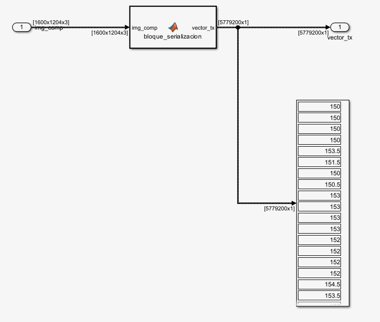

# Serialización de una Matriz (Imagen) para Transmisión hacia una USRP

La serialización de una matriz, en el contexto del procesamiento de señales y la comunicación
con una USRP (*Universal Software Radio Peripheral*), es el proceso mediante el cual una
estructura de datos bidimensional —como una imagen o una matriz de valores complejos— se
convierte en una secuencia lineal (unidimensional) de muestras que puede ser transmitida de
forma continua a través de una interfaz de datos hacia el hardware de radio.

---

## ¿En qué consiste el proceso?

Una imagen o matriz está organizada en filas y columnas, formando una estructura 2D. Sin
embargo, la USRP espera recibir los datos como un flujo continuo y ordenado de muestras,
generalmente en formato de números complejos **(I/Q)**. La serialización toma esa matriz y
"desenrolla" sus elementos —fila por fila o columna por columna— generando un vector plano.

Este vector luego se **normaliza**, se **escala** al rango de amplitud adecuado y se envía
muestra a muestra al dispositivo mediante protocolos como:

- **UHD** (*USRP Hardware Driver*)
- **GNU Radio**

---

## Implementación en MATLAB/Simulink

### Diagrama del bloque de serialización



El diagrama muestra el flujo de datos dentro del entorno **Simulink**. La imagen de entrada
`img_comp` ingresa con una dimensión de **[1600 x 1204 x 3]**, correspondiente a una imagen
en color (RGB) de 1600 píxeles de ancho, 1204 de alto y 3 canales de color.

Este dato es procesado por el bloque **`bloque_serializacion`**, un *MATLAB Function Block*
que transforma la matriz 3D en un vector unidimensional de dimensión **[5779200 x 1]**,
resultado de multiplicar `1600 × 1204 × 3 = 5.779.200` muestras. A la derecha del diagrama
se puede observar una vista previa del vector resultante `vector_tx`, cuyos primeros valores
se encuentran en el rango de **150 – 154.5**, correspondientes a los niveles de intensidad
de los píxeles de la imagen original.

---

### Código del bloque de serialización


El bloque de serialización está implementado como una función de MATLAB con la directiva
`%#codegen`, lo que permite su uso dentro de Simulink y su posterior generación de código
en C/C++ si fuera necesario.
```matlab
function vector_tx = bloque_serializacion(img_comp)
%#codegen
    vector_tx = img_comp(:);
end
```

La lógica central del bloque se reduce a una sola instrucción: **`img_comp(:)`**, que en
MATLAB aplana cualquier arreglo multidimensional en un vector columna, recorriendo los
elementos en **orden column-major** (columna por columna, canal por canal). Esto garantiza
que toda la información de la imagen quede contenida en una secuencia lineal y continua,
lista para ser transmitida hacia la USRP.

| Parámetro | Descripción |
|---|---|
| **Entrada** `img_comp` | Imagen comprimida en formato `double`, dimensión `H x W x 3` |
| **Salida** `vector_tx` | Vector serializado en formato `double`, dimensión `(H*W*3) x 1` |
| **Operación** | `img_comp(:)` — aplana la matriz 3D a un vector 1D |
| **Directiva** | `%#codegen` — habilita la generación de código desde Simulink |

---

## ¿Por qué se hace?

| Razón | Descripción |
|---|---|
| **Compatibilidad con el hardware** | La USRP opera sobre un flujo de datos en tiempo real; no puede interpretar estructuras multidimensionales directamente. |
| **Continuidad del flujo** | La transmisión de RF exige que las muestras lleguen de forma continua y sin interrupciones para evitar *underflows* (subdesbordamientos del buffer). |
| **Mapeo a señal analógica** | Cada muestra serializada representa un punto I/Q en el tiempo, lo que permite que el DAC de la USRP lo convierta en una señal de radiofrecuencia real. |
| **Control del orden de transmisión** | La serialización permite definir explícitamente el orden en que la información es enviada, lo cual es crítico para la correcta reconstrucción o interpretación de la señal en el receptor. |

---

## Conclusión

> La serialización es el puente entre la representación lógica de la información (una imagen o
> matriz) y la representación física requerida por el hardware de transmisión. En este caso,
> la instrucción `img_comp(:)` de MATLAB condensa todo ese proceso en una sola línea,
> convirtiendo una imagen RGB de más de 5 millones de píxeles en un flujo continuo listo
> para ser emitido por la USRP.
